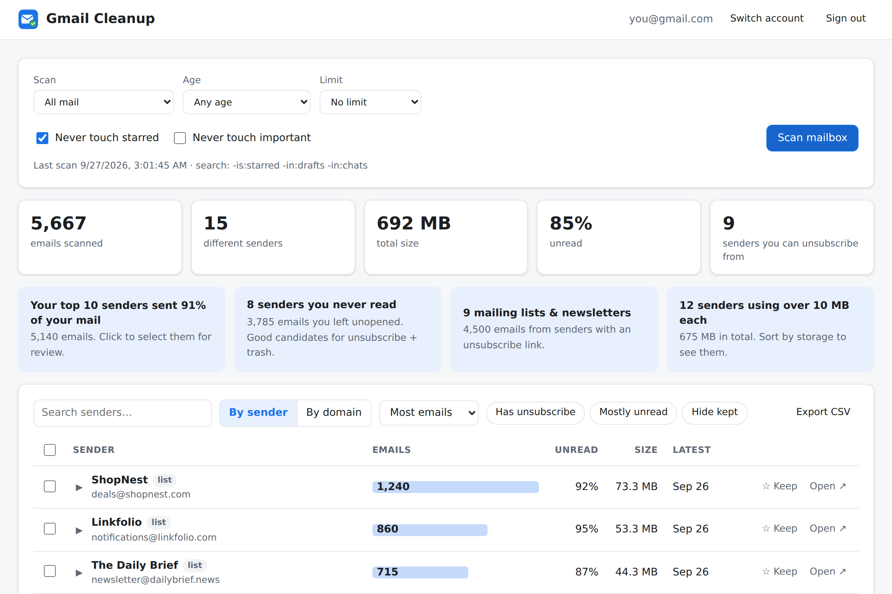
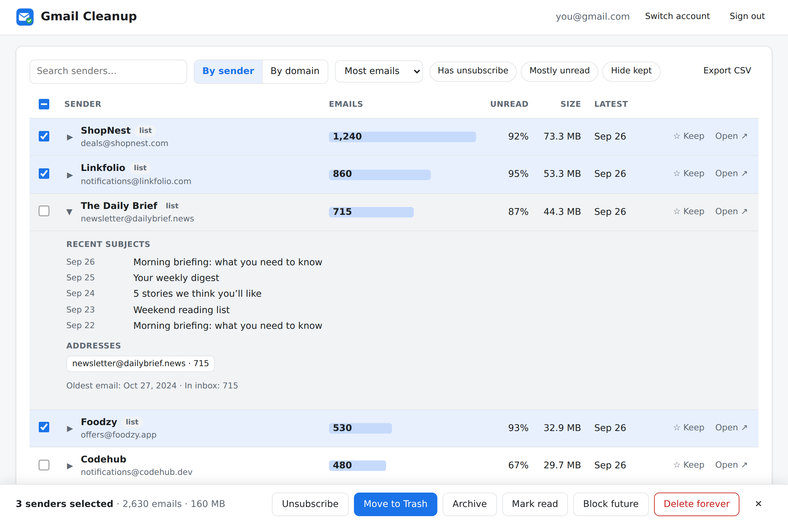
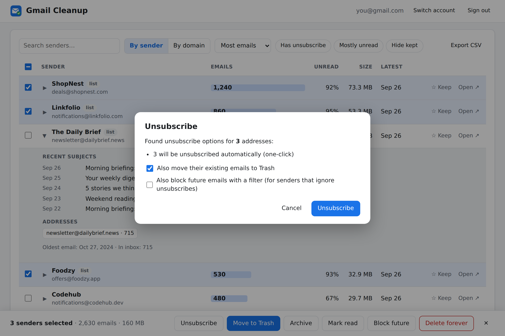
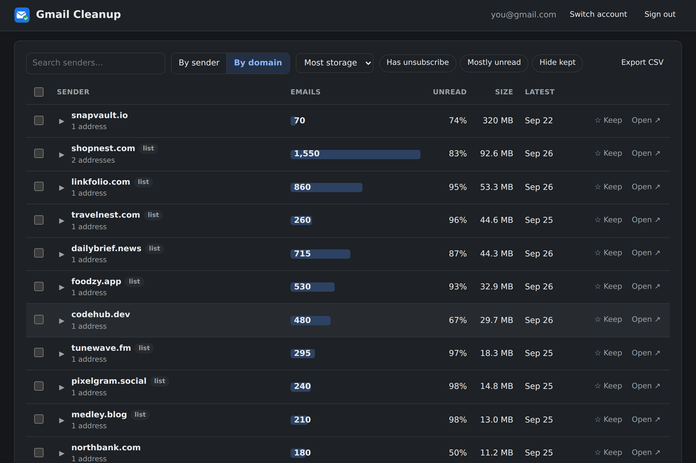
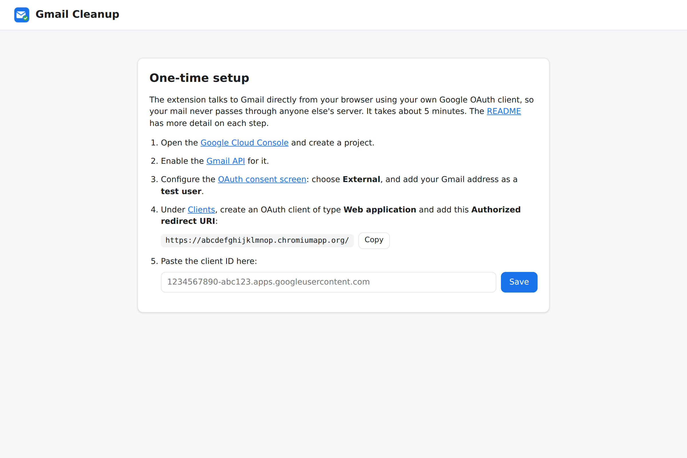

<div align="center">


# Gmail Cleanup

**See who fills your Gmail the most, then clean them out in bulk.**

A Chrome extension that ranks every sender in your mailbox by how much they send, and lets you trash, unsubscribe, block or archive them a few hundred at a time. It runs entirely in your browser.

[](https://github.com/RisticDjordje/GmailCleanupExtension/actions/workflows/test.yml)

[](LICENSE)



</div>

## Features

### See who is filling your mailbox
- Every email grouped **by sender** or **by domain** (all of `*.shopnest.com` together).
- Sort by **most emails**, **most storage**, **most unread**, newest, oldest or name.
- For each sender: email count, % unread, total size and latest date. Expand a row for recent subject lines and every address they used.
- **Insight cards** point out easy wins: senders you never read, mailing lists, storage hogs, and how much of your mail your top 10 senders send.
- Search, filters (*Has unsubscribe*, *Mostly unread*, *Hide kept*) and **CSV export**.



### Clean up in bulk
Select any number of senders, then:

| Action | What happens |
|---|---|
| **Move to Trash** | Trashes every email from them. Gmail empties Trash after 30 days. **Undo** is available right after. |
| **Unsubscribe** | Uses the sender's own unsubscribe header: one-click unsubscribe where supported, otherwise it sends the unsubscribe email for you, otherwise it gives you the links. Optionally trashes their mail and blocks them in the same step. |
| **Block future** | Creates Gmail filters that send their future mail to Trash, or skip the inbox (optionally marking it read). |
| **Archive** / **Mark read** | Clear the inbox or the unread count. Undoable. |
| **Delete forever** | Skips Trash. Asks for the extra permission this needs only when you first use it. |



### Built to be safe
- Every action first shows a confirmation with the **exact number of emails** it will affect.
- **Never touch starred** (on by default) and **never touch important** options.
- Mark a sender as **Keep** (☆) so they can't be selected for bulk actions.
- Actions only apply to what you scanned. If you scanned "older than 1 year", trashing a sender only removes their mail from more than a year ago.

### Scanning
- Scan all mail, the inbox, a Promotions/Social/Updates/Forums tab, unread mail, emails over 5 MB, or any **custom Gmail search** (e.g. `before:2020/01/01 has:attachment`).
- Optional age filter and limit for a quick first look.
- Results are **cached per account**, so reopening is instant, rescans only read new mail, and you can switch between several Gmail accounts.
- You can stop a scan at any time and continue it later.

**Extra tools:** empty Trash or Spam immediately, clear the kept list, clear the local cache. Includes dark mode.



## Install

This is a personal extension, loaded straight from this folder and not from the Chrome Web Store. Gmail only lets apps read mail through a Google sign-in key, so you create your own free key once. It takes about 5 minutes and doesn't need a credit card.



### 1. Load the extension
1. [Download this repo as a ZIP](https://github.com/RisticDjordje/GmailCleanupExtension/archive/HEAD.zip) and unzip it somewhere permanent (not a folder you clean out).
2. Open `chrome://extensions`, turn on **Developer mode** (top right), click **Load unpacked** and choose the unzipped folder (the one containing `manifest.json`).
3. Pin the extension from the puzzle-piece menu and click its icon. The dashboard opens and shows your **redirect URI**, which looks like `https://<extension-id>.chromiumapp.org/`.

### 2. Create a Google Cloud project
1. Open [console.cloud.google.com/projectcreate](https://console.cloud.google.com/projectcreate), name the project (e.g. *Gmail Cleanup*) and click **Create**.
2. Open the [Gmail API page](https://console.cloud.google.com/apis/library/gmail.googleapis.com), check that your new project is selected at the top, and click **Enable**.

### 3. Set up the sign-in screen
1. Open [Google Auth Platform](https://console.cloud.google.com/auth/overview) and click **Get started**.
2. Fill in an app name and your email, choose **External** as the audience, agree to the policy and click **Create**.
3. Go to **Audience → Test users → Add users** and add **every Gmail address you want to clean up**. Leave the app in *Testing* mode.

### 4. Create the client ID
1. Go to **Clients → Create client**. Choose application type **Web application**.
2. Under **Authorized redirect URIs**, add the redirect URI from the dashboard, *including the trailing slash*.
3. Click **Create** and copy the **Client ID** (ends in `.apps.googleusercontent.com`). You don't need the secret.

### 5. Sign in
Paste the client ID into the dashboard, click **Save**, then **Sign in with Google**. Google will say *"Google hasn't verified this app"*. That's expected for your own app: click **Continue**, then **Select all** on the permissions screen.

**First run:** try *Scan: Promotions tab* with *Limit: Newest 2,000*. It takes about a minute.

## Troubleshooting

| Problem | Fix |
|---|---|
| `redirect_uri_mismatch` | The URI in Step 4 must match the dashboard exactly, including the trailing `/`. |
| *Access blocked* / `access_denied` | That Gmail address isn't a **test user** yet (Step 3.3). Each account you switch to needs to be listed. |
| *Authorization page could not be loaded* | Wrong client ID, or the client isn't the *Web application* type. |
| *Google didn't give the extension access* | On the permissions screen, tick every box (or **Select all**). |
| It worked, then suddenly `redirect_uri_mismatch` | You moved the extension folder, which changes its ID. Add the new redirect URI to the same client. |

## Privacy and permissions

The extension only reads message **headers** (sender, subject, date, size, unsubscribe info), never message bodies. It talks directly to Google's Gmail API from your browser; there is no server. Tokens and the scan cache stay in your Chrome profile, and **Sign out** revokes access.

| Permission | Why |
|---|---|
| `gmail.modify` | Read headers, trash, archive, mark read and send unsubscribe emails. It **cannot** permanently delete. |
| `gmail.settings.basic` | Create filters for "Block future". |
| `https://mail.google.com/` | Only requested the first time you use **Delete forever** or **Empty Trash/Spam**. |
| `identity`, `storage`, `unlimitedStorage` | Sign-in, settings and the local scan cache. |

## Performance

Gmail lets each user make about 250 API "quota units" per second, and reading one message costs 5. That means about **40 messages per second**: 10,000 emails take about 4 minutes and 100,000 about 40 minutes the first time. Later scans only read new mail. Bulk actions handle 1,000 emails per request.

## Development

```
manifest.json       Manifest V3; clicking the icon opens dashboard.html
dashboard.*         the UI
lib/parse.js        pure helpers: header parsing, grouping, Gmail queries (unit-tested)
lib/gmail.js        Gmail REST client: quota-aware rate limiter, retries, token refresh
lib/auth.js         OAuth via chrome.identity.launchWebAuthFlow
lib/db.js           per-account IndexedDB cache of message headers
tests/harness.mjs   fake Gmail API + chrome.* mock for browser tests
```

```sh
npm install          # installs Playwright (only needed for the browser tests)
npm test             # unit tests
npm run test:e2e     # drives the dashboard in Chromium against a fake Gmail
npm run screenshots  # regenerates docs/screenshots from a fictional mailbox
npm run package      # zip for sharing
```

After editing the code, click the reload icon on the extension's card in `chrome://extensions`.

## License

[MIT](LICENSE)
